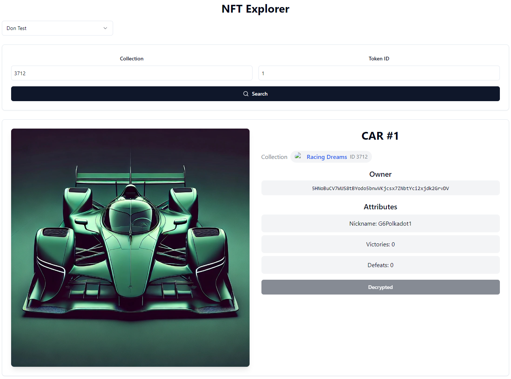

# NFT Data Obfuscation Example with CryptoJS and Polkadot

This repository demonstrates two approaches to obfuscate NFT data attributes. The first approach uses the **CryptoJS** library for encryption, and the second approach utilizes **Polkadot**'s cryptographic utilities to perform obfuscation. Both methods are implemented to ensure that sensitive information is protected and only accessible to the NFT owner.

## Table of Contents

- [Setup](#setup)
- [Approach 1: Encryption with CryptoJS](#approach-1-encryption-with-cryptojs)
- [Approach 2: Encryption with Polkadot Utilities](#approach-2-encryption-with-polkadot-utilities)
- [How to Run](#how-to-run)
- [CryptoJS Example](#cryptojs-example)
- [Polkadot Example](#polkadot-example)
- [Important Notes](#important-notes)

## Setup

1. **Clone the repository**:

   ```
   git clone https://github.com/DukkeA/g6-unique-challenge.git
   ```

2. **Install dependencies** (into cryptojs or polkadot frontend and backend folders):

   ```
   npm install
   ```

3. **Set up environment variables** (into cryptojs or polkadot folder backend folder):
   Create a .env file in the root directory and add your mnemonic:

   ```
   MNEMONIC="your mnemonic here"
   ```

## Approach 1: Encryption with CryptoJS

This approach uses the CryptoJS library to encrypt NFT attributes. The encrypted data is stored in the blockchain and can only be decrypted by the owner.

**How It Works**

- **Encryption:** We use AES encryption to encrypt NFT attributes such as nicknames.
- **Decryption:** On the frontend, the user must provide their signature to decrypt the data.

**Backend Code Example**

```
import CryptoJS from 'crypto-js';

// Function to encrypt data using CryptoJS
const encryptData = (data, secret) => {
  return CryptoJS.AES.encrypt(data, secret).toString();
};

// Usage example
const secret = "your-secret-key";
const encryptedNickname = encryptData("nickname", secret);
```

**Frontend Integration Example**

```
const decryptData = (encryptedData, secret) => {
  const bytes = CryptoJS.AES.decrypt(encryptedData, secret);
  return bytes.toString(CryptoJS.enc.Utf8);
};

// Usage example
const decryptedNickname = decryptData(encryptedNickname, secret);
```

## Approach 2: Encryption with Polkadot Utilities

This approach uses Polkadot's cryptographic utilities to perform encryption and decryption, which ensures that only the NFT owner can decrypt the data using their Polkadot wallet.

**How It Works**

- **Encryption:** Utilizes the sr25519Sign method from Polkadot to sign a message with the owner's private key. The signature is then used as the encryption key.
- **Decryption:** The frontend signs a message with the user's private key to generate the decryption key, which is then used to decrypt the data.

**Backend Code Example**

```
import { mnemonicToMiniSecret, sr25519PairFromSeed, sr25519Sign } from '@polkadot/util-crypto';
import { u8aToHex, stringToU8a, u8aConcat } from '@polkadot/util';

const mnemonic = process.env.MNEMONIC;
const { publicKey, secretKey } = sr25519PairFromSeed(mnemonicToMiniSecret(mnemonic));

const message = stringToU8a('Authorize decryption');
const signedMessage = sr25519Sign(publicKey, { publicKey, secretKey }, message);

const encryptionKey = signedMessage;
const nickname = "YourNickname";
const nicknameBytes = stringToU8a(nickname);

const encryptedNicknameBytes = u8aConcat(nicknameBytes, encryptionKey);
const encryptedNicknameHex = u8aToHex(encryptedNicknameBytes);
```

**Frontend Integration Example**

```
import { u8aToHex, hexToU8a, u8aToString } from '@polkadot/util';
import { web3Enable, web3FromAddress } from '@polkadot/extension-dapp';

const signMessage = async (address, message) => {
  await web3Enable("my dapp");
  const injector = await web3FromAddress(address);
  const signRaw = injector?.signer?.signRaw;

  if (signRaw) {
    const { signature } = await signRaw({
      address,
      data: u8aToHex(stringToU8a(message)),
      type: "bytes",
    });
    return signature;
  }
  return null;
};

const decryptData = (encryptedData, signature) => {
  const encryptionKey = hexToU8a(signature);
  const encryptedBytes = hexToU8a(encryptedData);
  const decryptedBytes = encryptedBytes.slice(0, -encryptionKey.length);
  return u8aToString(decryptedBytes);
};
```

## How to Run

Move into the **backend** folder approach you want to test (cryptojs or polkadot)

1. **Create a Substrate Account**:
2. **Get OPL (testnet) tokens: https://t.me/unique2faucet_opal_bot**:
3. **Create a Collection**:

```
node ./src/1-collection-cars.js
```

4. **Create a NFT**:

```
node ./src/3-create-car.js {collectionId} {address} {nickname}
```

Move into the **frontend** folder approach you want to test (cryptojs or polkadot)

5. **Run Frontend**:

```
npm run start
```

## CryptoJS Example

- Creating a collection and a NFT:


- Viewing the nickname data without the owner's account in the frontend:


- Viewing with the owner's account:


## Polkadot Example

- Creating a collection and a NFT:


- Viewing the nickname data without the owner's account in the frontend:


- Viewing with the owner's account:



## Important Notes

- For these examples we're just obfuscating nickname's data
- In case we understood the challenge correctly and you want to obfuscate the NFT's attributes, we would recommend to add another key/value to the objects like this:

```
  attributes: [
  {
  trait_type: "Nickname",
  value: encryptedNickname,
  public: false,
  },
  ],
```
